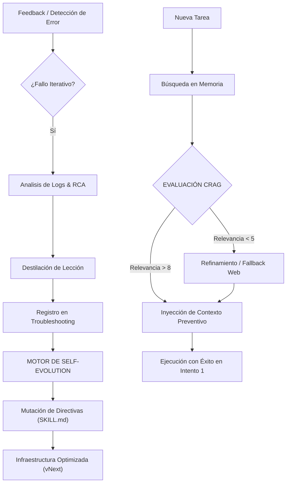

# MEMORIA PHVA VECTORIZADA: La Evolución de la Adaptabilidad en Agentes Autónomos

**Autor:** Javier Gómez M.  
**Concepto:** Blueprint Meridian Infrastructure  
**Fecha:** 1 de Marzo, 2026

---

## 📄 Abstract

En la arquitectura contemporánea de agentes de Inteligencia Artificial, la persistencia del aprendizaje post-ejecución sigue siendo un desafío crítico. A pesar de los avances en técnicas de auto-corrección (*Self-Refine*) y bucles de reflexión (*Reflexion*), la mayoría de los agentes operan bajo una condición de "Amnesia Estructural". Este artículo presenta el concepto de **Memoria PHVA Vectorizada v2.0**, un marco de trabajo que no solo integra el ciclo clásico de mejora continua (Planear-Hacer-Verificar-Actuar) con almacenamiento vectorial, sino que ahora incorpora **Inteligencia Correctiva (CRAG)** y **Capacidad de Auto-Evolución (Self-Evolution)**. Esta arquitectura transforma la fase de "Actuar" de una mera corrección manual en una reconfiguración estructural autónoma, logrando un sistema que no solo recuerda sus errores, sino que muta sus propias directivas para prevenirlos.

  <b>Control de Versiones:</b> v2.0.0 · <b>Última Actualización:</b> 2026-03-01 · <b>Cambios:</b> Integración de CRAG Protocol y Motor de Self-Evolution

## 1. Introducción: Del Ciclo de Deming a la Arquitectura Agéntica

El ciclo PHVA (Plan-Do-Check-Act) ha sido el estándar de oro en la gestión de calidad industrial. En Antigravity, hemos evolucionado este ciclo para que la fase de **Actuar** sea el motor de una infraestructura que aprende.

### 2.0 Arquitectura v2.0: El Salto Evolutivo

La versión 2.0 de la Memoria PHVA Vectorizada introduce dos componentes críticos que resuelven los cuellos de botella de la recuperación de información y la aplicación de lecciones aprendidas:

#### 2.1 Corrective RAG (CRAG) — El Filtro de Relevancia
Uno de los riesgos del RAG tradicional es la inyección de "ruido" (información recuperada que no aplica al contexto actual). El **Protocolo CRAG** integrado en el ciclo PHVA añade una capa de evaluación semántica:
- **Scoring de Relevancia:** Cada lección recuperada de la memoria vectorial es puntuada (0-10).
- **Trigger Correctivo:** Si el puntaje es bajo (< 5), el sistema rechaza la memoria local y activa automáticamente una búsqueda refinada o investigación profunda (*Deep Research*).
- **Beneficio:** Elimina alucinaciones basadas en lecciones obsoletas o de stacks tecnológicos diferentes.

#### 2.2 Motor de Self-Evolution (Auto-Mejora Estructural)
Mientras que la v1.1 se centraba en *almacenar* el error, la v2.0 se centra en *erradicarlo* del manual de procedimientos.
- **Mutación de Skills:** El sistema analiza patrones de error recurrentes en la base de datos de troubleshooting y propone cambios directos en las instrucciones base (`SKILL.md`).
- **Inmunidad Estructural:** El conocimiento pasa de ser una "pista" recuperada a ser una "Regla de Oro" mandatoria en el ADN del agente.
- **Beneficio:** Automatiza la mejora continua, reduciendo la intervención humana en la optimización de la infraestructura.

---

## 3. Definición del Concepto: La Memoria PHVA Vectorizada

La **Memoria PHVA Vectorizada** es un sistema de **Persistencia Continua Inter-Sesional**. En su versión 2.0, se define por la capacidad del sistema para:

1.  **Atomizar el Error:** Descomponer una falla técnica en su síntoma, causa raíz y solución.
2.  **Validar la Memoria (CRAG):** Asegurar que la experiencia previa es 100% relevante al problema actual.
3.  **Auto-Programar la Mejora (Self-Evolution):** Traducir los fallos históricos en nuevas directivas de seguridad y calidad.

### 3.1 El Nuevo Bucle de Retroalimentación v2.0

## 4. Importancia y Beneficios de la v2.0

*   **Precisión de Memoria (CRAG):** Evita que el agente intente aplicar soluciones de React a un proyecto de Vue solo porque ambos mencionan "componentes".
*   **Autonomía Evolutiva:** El sistema detecta sus propias debilidades y sugiere cómo arreglarlas en su propio "código de conducta" (Skills).
*   **Eficiencia Terminal:** La curva de aprendizaje es más pronunciada, reduciendo drásticamente el desperdicio de tokens por reincidencia de errores conocidos.

## 5. Análisis de Eficiencia (v2.0 Update)

> **Interpretación Especialista:** Con la integración de CRAG y Self-Evolution, el Proyecto 1 (Curva de Aprendizaje) ahora genera no solo datos, sino **cambios estructurales**. Esto desplaza el punto de equilibrio hacia una eficiencia operativa total mucho más rápido que los métodos de RAG pasivo.

---

*Desarrollado bajo el estándar **Blueprint Meridian**.*
*© 2026 Javier Gómez M. — Ingeniería Agéntica.*
