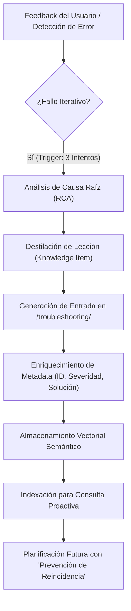
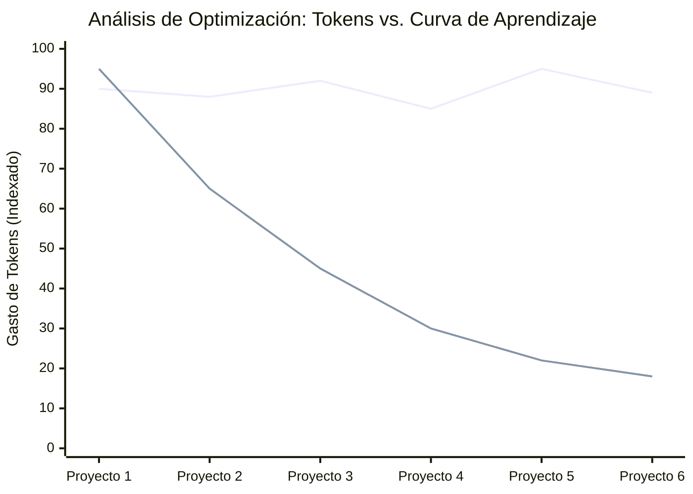

# MEMORIA PHVA VECTORIZADA: La Evolución de la Adaptabilidad en Agentes Autónomos

**Autor:** Javier Gómez M.  
**Concepto:** Blueprint Meridian Infrastructure  
**Fecha:** 26 de Febrero, 2026

---

## 📄 Abstract

En la arquitectura contemporánea de agentes de Inteligencia Artificial, la persistencia del aprendizaje post-ejecución sigue siendo un desafío crítico. A pesar de los avances en técnicas de auto-corrección (*Self-Refine*) y bucles de reflexión (*Reflexion*), la mayoría de los agentes operan bajo una condición de "Amnesia Estructural": la capacidad de corregir un error dentro de una sesión no garantiza la evitación de ese mismo error en interacciones futuras. Este artículo presenta el concepto de **Memoria PHVA Vectorizada** (Vectorized PHVA Memory), un marco de trabajo que integra el ciclo clásico de mejora continua (Planear-Hacer-Verificar-Actuar) con almacenamiento vectorial asíncrono. Esta arquitectura transforma la fase de "Actuar" de una mera corrección temporal en una reconfiguración estructural de la base de conocimientos del agente, logrando una tasa de reincidencia de errores cercana a cero.

## 1. Introducción: Del Ciclo de Deming a la Arquitectura Agéntica

El ciclo PHVA (Plan-Do-Check-Act) ha sido el estándar de oro en la gestión de calidad industrial durante décadas. Su traslación al campo de los Grandes Modelos de Lenguaje (LLMs) y agentes autónomos es natural pero, hasta ahora, ha carecido de una dimensión de persistencia evolutiva.

En un flujo estándar, el agente divide la tarea (**Plan**), ejecuta acciones (**Hacer**) e inspecciona resultados (**Verificar**), implementando ciclos iterativos propuestos por autores de técnicas como *Self-Refine* (Madaan et al.) o el marco de trabajo *Reflexion* (Shinn et al.). Sin embargo, la verdadera innovación y el **valor agregado de Antigravity** surgen en el cierre del ciclo: la fase de **Actuar** realizada al finalizar el proyecto.

En lugar de limitarse a corregir el código para cumplir con el prompt inmediato, el sistema ejecuta una **Retrospectiva Post-Ejecución**. En esta etapa, el agente realiza una lectura profunda de los logs de la sesión, identifica los errores persistentes que requirieron múltiples intentos de solución y los destila como registros permanentes indexados vectorialmente en una base de datos de troubleshooting para consultas futuras.

## 2. Definición del Concepto: La Memoria PHVA Vectorizada

La **Memoria PHVA Vectorizada** no es solo un registro histórico; es un sistema de **Persistencia Continua Inter-Sesional**. Se define por la capacidad del sistema para:

1.  **Atomizar el Error:** Descomponer una falla técnica en su síntoma, causa raíz y solución óptima.
2.  **Vectorizar la Lección:** Convertir la experiencia de resolución en un embedding semántico que reside en una base de datos de "Troubleshooting".
3.  **Consulta Proactiva:** Realizar una búsqueda de similitud semántica *antes* de la fase de "Planear" en tareas futuras, inyectando contexto preventivo directamente en el prompt del sistema.

### 2.1 El Bucle de Retroalimentación y Almacenamiento

El siguiente diagrama ilustra el proceso de adquisición de conocimiento mediante el cual Antigravity "aprende" de sus propios ciclos de ejecución:

## 3. Dinámica del Trigger de Troubleshooting: La Regla de los Tres Fallos

Para optimizar la relación entre **calidad de respuesta** y **costo computacional**, el sistema implementa un disparador heurístico basado en la persistencia del error. No todo error merece ser vectorizado, pero todo error recurrente *debe* ser erradicado.

**El Algoritmo del Trigger:**
1.  **Observación:** Ante un error (ej. CSS layout shift), el agente aplica una solución estándar.
2.  **Validación:** Si el usuario rechaza la solución o el subagent de verificación detecta el mismo síntoma, se registra un `iteration_count++`.
3.  **Activación de Resiliencia y Retrospectiva:** Al finalizar el proyecto, o ante un `iteration_count == 3` crítico, el sistema activa la lectura de logs de ejecución. Identifica los patrones de fallo corregidos y realiza una **consulta profunda** a la Memoria PHVA Vectorizada.
4.  **Resolución y Meta-Aprendizaje:** Si el problema es nuevo y se resolvió tras el análisis de logs, se ejecuta una tarea asíncrona de "Actuar" para documentar el caso, asegurando que en el futuro, el error sea mitigado en el **Intento 1**.

## 4. Importancia y Beneficios de la Estandarización

Cargar esta skill en entornos colaborativos como GitHub aporta beneficios tangibles tanto para el desarrollador individual como para la comunidad de ingeniería agéntica:

*   **Estandarización del Conocimiento:** Crea un lenguaje común para documentar fallos de IA, permitiendo que diferentes agentes compartan una "base de datos de sabiduría" compatible.
*   **Reducción de la Frustración del Usuario:** Minimiza los ciclos de "ida y vuelta" donde el usuario corrige al agente sobre lo mismo repetidamente.
*   **Auditabilidad:** Permite a los arquitectos de sistemas revisar *qué* está aprendiendo el agente y corregir posibles sesgos en las lecciones aprendidas.
*   **Portabilidad de la Inteligencia:** Las lecciones aprendidas en un proyecto de React pueden inyectarse preventivamente en un proyecto de Next.js si el embedding semántico detecta similitud en la arquitectura de componentes.

## 5. Análisis de Eficiencia: Ahorro de Recursos en el Largo Plazo

La siguiente visualización técnica compara la progresión del gasto de tokens entre un sistema reactivo tradicional y un sistema evolutivo basado en PHVA Vectorizado.

> **Interpretación Especialista:** El ligero incremento inicial en el Proyecto 1 refleja el costo de la vectorización y el "overthinking" controlado para documentar el error. A partir del Proyecto 2, la pendiente de ahorro se vuelve agresiva, convergiendo hacia un estado de "Eficiencia Terminal" donde el agente opera con un conocimiento pre-cargado de casi todas las trampas técnicas comunes.

## 5. Conclusión: El Código como Ente Evolutivo

La **Memoria PHVA Vectorizada** marca el fin de la IA como una herramienta estática y el inicio de la IA como un colaborador dinámico que acumula "sabiduría técnica". Al cargar esta skill en comunidades como GitHub, permitimos que la infraestructura no solo sea ejecutable, sino que sea capaz de mejorar con cada error cometido.

La calidad suprema no reside en no cometer errores, sino en garantizar que cada error solo se cometa una vez en la historia de la infraestructura.

---

*Desarrollado bajo el estándar **Blueprint Meridian**.*
*© 2026 Javier Gómez M. — Ingeniería Agéntica.*
