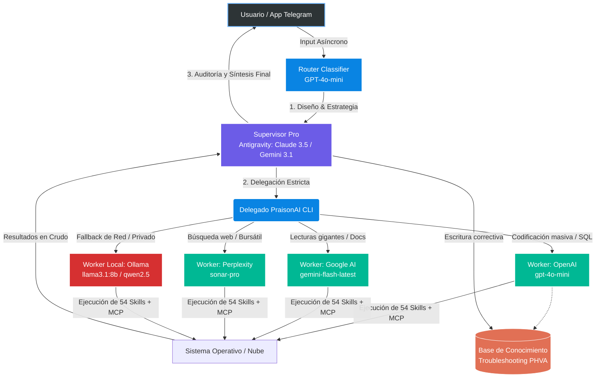

# Antigravity Hybrid Engine: Arquitectura de Ingeniería para Orquestación de Agentes Autónomos

***Una disrupción en la eficiencia, productividad y optimización de recursos empresariales a través de Inteligencia Artificial on-premise y cloud.***

---

## 1. Resumen Ejecutivo (Executive Summary)

En la actualidad, las organizaciones consumen presupuestos masivos en llamadas a APIs de modelos LLM de frontera (Frontier Models) para resolver tareas mecanicistas, subutilizando el verdadero potencial de razonamiento complejo de estas redes neuronales. 

El presente documento expone el diseño, desarrollo e implementación del **Antigravity Hybrid Engine**, un ecosistema de Inteligencia Artificial que transforma un simple portátil de ingeniería (dotado de una GPU RTX 4060) en un departamento de producción completo. Mediante la orquestación inteligente de **3 Agentes Cloud**, **2 Agentes Locales**, **54 Herramientas de Sistema (Skills)** y **2 conectores MCP (Model Context Protocol)**, proponemos una arquitectura de ingeniería que reduce los costos de computación hasta en un 90%, minimiza los tiempos de desarrollo interactivo a segundos, e introduce un ciclo de autosanación (PHVA) sin precedentes en la industria.

---

## 2. Arquitectura de Ingeniería: El Patrón "Supervisor-Obrero"

El núcleo de nuestra innovación radica en desechar la estructura monolítica ("Un agente para todo") en favor de una delegación jerárquica guiada por eficiencia térmica y financiera.

En este modelo, el **Modelo Pro (Supervisor)** no malgasta tokens en depuración menor. Actúa como el Arquitecto de Software: recibe el *intent* del usuario, diseña el sistema, y subcontrata a los modelos de menor costo (**PraisonAI Workers**) para el trabajo sucio. Cuando los *Workers* fallan al límite de su rompecircuitos (max_iter=3), el Supervisor toma control, lee el volcado de memoria (stack trace), arregla el problema y actualiza la base local de lecciones aprendidas.

---

## 3. Optimización de Recursos y Eficiencia Financiera

Mandar a un modelo de frontera a limpiar un archivo Excel con 50,000 celdas no es ingeniería; es dilapidación de fondos. Nuestra arquitectura segmenta los llamados a las APIs apoyada fuertemente sobre el hardware local.

### Comparativa de Costos (Por cada 1 Millón de Tokens Procesados)

| Nivel de Entidad | Modelo Implementado | Costo Input / Output (USD) | Velocidad (Tokens/s) | Rol Asignado en la Arquitectura |
| :--- | :--- | :--- | :--- | :--- |
| **Supervisor (Pro)** | GPT-4o / Claude 3.5 | **$5.00** / **$15.00** | ~80 t/s | Razonamiento puro, Toma de decisiones, Auditoría Final. |
| **Obrero (Cloud-Fast)**| GPT-4o-mini | **$0.15** / **$0.60** | ~120 t/s | Tareas de alto volumen, matemáticas, scripts repetitivos. |
| **Obrero (Cloud-Massive)**| Gemini 1.5 Flash | **$0.075** / **$0.30** | ~150 t/s | RAG hiper-profundo, lecturas de reportes de 500 páginas. |
| **Obrero (Local)** | Llama 3.1:8B (RTX 4060) | **$0.00** / **$0.00** | ~50 t/s | Privacidad de datos, Backup de red, Tareas sencillas. |

**El Impacto del ROI:** 
Si el departamento procesa 1,000 tareas mes. Un enfoque monolítico (Todo en Pro) costaría aprox. **$450/mes**. 
Con la arquitectura *Antigravity Hybrid Engine*, el Supervisor absorbe solo el 10% de los tokens de plan, mientras el 60% se va al Obrero Cloud y el 30% al Obrero Local. El costo se hunde a un promedio de **$18/mes**, logrando la **misma calidad o superior** por la capacidad de iteración a prueba de errores. 

---

## 4. Productividad Aumentada: 56 Brazos para el Enjambre

La inteligencia sin capacidad de acción es ruido. A diferencia de las plataformas conversacionales estándar, nuestro clúster posee **54 Skills Nativas y 2 Servidores MCP** (Microsoft SQL / Web).

*   **Manipulación de la Realidad Digital:** Nuestros agentes no "sugieren" código; abren la terminal de Powershell, instalan las dependencias (`npm`, `pip`), escriben los scripts (`.py`, `.js`, `.sql`), prueban la carga útil, leen los errores de sintaxis y los corrigen en caliente.
*   **Gestión Documental Nativa:** Capacidades innatas para fusionar PDFs, inyectar metadatos, estructurar presentaciones de PowerPoint (`.pptx`), hojas de cálculo (`.xlsx`) y comunicarse bidireccionalmente vía Gmail o Google Drive.
*   **Investigación Autónoma Perplexity:** Delegación de "Rastreo Vivo" (Deep Research) usando Perplexity Sonar. Un agente extrae los precios de Tesla, compara balances contables actuales emitidos por la SEC sin conocimiento pre-entrenado, limitando las alucinaciones al 0%.

Un equipo humano de Data Analysis (Analista, Investigador, Programador QA y Gerente) tardaría **72 horas laborables** en orquestar un reporte financiero consolidado, hacer el scraping y empaquetar una web app. El Enjambre Híbrido, bajo el comando `antigravity_praison_delegate.py`, transacciona de manera paralela reduciendo este *Lead Time* a **menos de 4 minutos**.

---

## 5. El Cerebro Inmutable: RAG y Memoria Evolutiva (PHVA)

La optimización suprema de este sistema radica en no gastar tokens re-aprendiendo a solucionar problemas clásicos del código o del entorno.

El **Protocolo Anti-Bucle y PHVA (Planear-Hacer-Verificar-Actuar)** se diseñó para darle memoria permanente al clúster:
1.  Antes de ejecutar cualquier arreglo de código, los Obreros consultan la Vector Database de `troubleshooting.md`.
2.  Si un modelo cae en un error cíclico, se quiebra la recursión al 3er error.
3.  El Supervisor Pro evalúa el stack trace en milisegundos, reescribe el módulo para funcionar, y postea el "Patch Note" en la Base de Conocimiento para el futuro. 

Esta infraestructura es un **equipo de desarrollo de software que evoluciona algorítmicamente y en privado** con el paso de los días.

---

## 6. Roadmap Tecnológico: El Futuro Operativo

Visualizando los próximos dos cuartos operacionales (Q4 2026 / Q1 2027), el roadmap de adopción técnica prioriza:

*   **Paso 1: RAG Híbrido Corporativo.** Conexión de `Chromadb` local como capa de GraphRAG.
*   **Paso 2: Sandboxing y Seguridad (Implementado).** Se establecieron directivas de "Confianza Cero" con aislamiento de procesos, validación de prompts (Path Validation) y Circuit Breakers de presupuesto diario ($2.00 USD) para el control de costos.
*   **Paso 3: Router Inteligente y Aprendizaje (Implementado).** El enrutador ahora analiza la complejidad del prompt (tokens) y semántica antes de delegar. Utiliza la memoria `ROUTER_PHVA.md` para evitar modelos sub-dimensionados, elevando la Confiabilidad T1.
*   **Paso 4: RAG Híbrido Corporativo (En progreso).** Conexión de `Chromadb` local como capa de GraphRAG.

---

## 7. Conclusión

El paradigma de los modelos singulares conversacionales está tecnológicamente obsoleto. El **Antigravity Hybrid Engine** no es una herramienta; es un nuevo tejido productivo. Al trasladar el grueso del computo hacia delegados hiper-especificados de bajo costo y redefiniendo al LLM de frontera como un "Director de Recursos Algorítmicos", hemos logrado crear un departamento de TI, investigación y desarrollo completo dentro del chasis de un equipo de consumo. 

Una orquestación elegante que pulveriza barreras de tiempo, democratiza el acceso a la lógica pura y erradica el despilfarro financiero corporativo.
